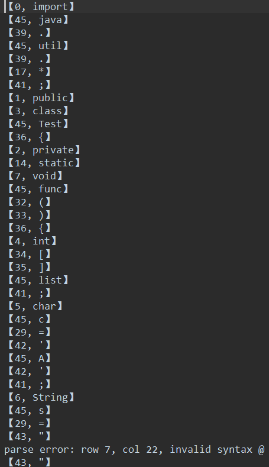

# 实验报告

## 实验截图

### 源文件

### 输入流

### Token 序列

## 实验步骤

- 选取 Java 语言中较为基础且常用的保留字和符号构建类别码表，并写出正规表达式
- 将每个正规表达式独立构造为一个 $NFA$
- 合并 $NFA$，将其转化为 $DFA$ 并做优化
- 根据 $DFA^o$ 编写代码
- 输入一段简单的 Java 代码文本，经过程序解析后输出相应的 Token 序列

## 实验详解

### 类别码表

| 类别码 | 符号串  |
| :----: | :-----: |
|   0    | import  |
|   1    | public  |
|   2    | private |
|   3    |  class  |
|   4    |   int   |
|   5    |  char   |
|   6    | String  |
|   7    |  void   |
|   8    | return  |
|   9    |   if    |
|   10   |  else   |
|   11   |   for   |
|   12   |  break  |
|   13   |  while  |
|   14   | static  |
|   15   |    +    |
|   16   |    -    |
|   17   |    *    |
|   18   |    /    |
|   19   |   +=    |
|   20   |   -=    |
|   21   |   ++    |
|   22   |   --    |
|   23   |   ==    |
|   24   |   !=    |
|   25   |    >    |
|   26   |    <    |
|   27   |   \>=   |
|   28   |   <=    |
|   29   |    =    |
|   32   |    (    |
|   33   |    )    |
|   34   |    [    |
|   35   |    ]    |
|   36   |    {    |
|   37   |    }    |
|   38   |    !    |
|   39   |    .    |
|   40   |    :    |
|   41   |    ;    |
|   42   |    '    |
|   43   |    "    |
|   44   | $Num$ |
|   45   | $Word$ |

### 正规表达式

- $Num$：$Num\rightarrow digit+$
  - $digit\rightarrow0|1|2|3|4|5|6|7|8|9$
- $Word$：$Word\rightarrow (letter|Letter)+$
  - $letter\rightarrow a|b|c|d|e|f|g|h|i|j|k|l|m|n|o|p|q|r|s|t|u|v|w|x|y|z$
  - $Letter\rightarrow A|B|C|D|E|F|G|H|I|J|K|L|M|N|O|p|Q|R|S|T|U|V|W|X|Y|Z$
- 其余类别码表中符号串的正规表达式即如表中所示

### NFA

### DFA

由于保留字也属于 $Word$，会产生冲突，采取在构造 $DFA$ 时先将其并入 $Word$，在程序中再做处理的办法

### DFA 优化

第一次

{ 0 } {1, ..., 29 }

第二次

{ 0 } { 4 }{ 5 }{ 7 }{ 8 }{ 9 }{ 10 }{ 12 }{ 14 }{ 16 }{18 }{ 19 }{ 20 }{ 21 }{ 22 }{ 23 }{ 24 }{ 25 }{ 26 }{ 27 }{ 28 }{ 29 } {1, 2, 3, 6, 11, 13, 15, 17}

第三次

{ 0 } { 4 }{ 5 }{ 7 }{ 8 }{ 9 }{ 10 }{ 12 }{ 14 }{ 16 }{18 }{ 19 }{ 20 }{ 21 }{ 22 }{ 23 }{ 24 }{ 25 }{ 26 }{ 27 }{ 28 }{ 29 }{ 1 }{ 2 }{ 3 }{ 6 }{ 11 }{ 13 }{ 15 }{ 17 }

故优化后的 $DFA^o$ 没有改变

### Token

- 实体模型
  - code：类别码
  - content：符号串内容
- 以【code，content】的格式输出

## 异常处理

- 在解析的同时记录当前字符的行列位置
- 当遇到无法解析的字符时，在输出结果中提示发生异常的行、列、字符
  - 格式：parse error: row [row], col [col], invalid syntax [syntax]

## 问题与解决

- 保留字判断问题
  - 保留字不能够像其他正规表达式一样判断，原因如下：
    - $Word$ 中可能包含保留字，如 important 包含 import
    - 保留字长度较长，如果采取和 += 相同的硬编码方式将产生大量冗余代码
  - 解决方案
    - 将保留字存储在一个列表中，索引与保留字的类别码相对应
    - 在 $Word$ 的解析完成后，在保留字列表中查询最终获得的字符串，若查询成功，则说明 $Word$ 是一个保留字

## 评价与感受

- 基本完成了预定的词法分析任务
- 但在从 $DFA^o$ 到代码的过程中由于各种原因并没有能够完全按照程式执行，可能是设计和具体实现上还存在一些缺陷
- 对于从 $RE$ 到 $NFA$，从 $NFA$ 到 $DFA$，从 $DFA$ 到 $DFA^o$，从 $DFA^o$ 到词法分析器代码的过程有了更加深入的理解